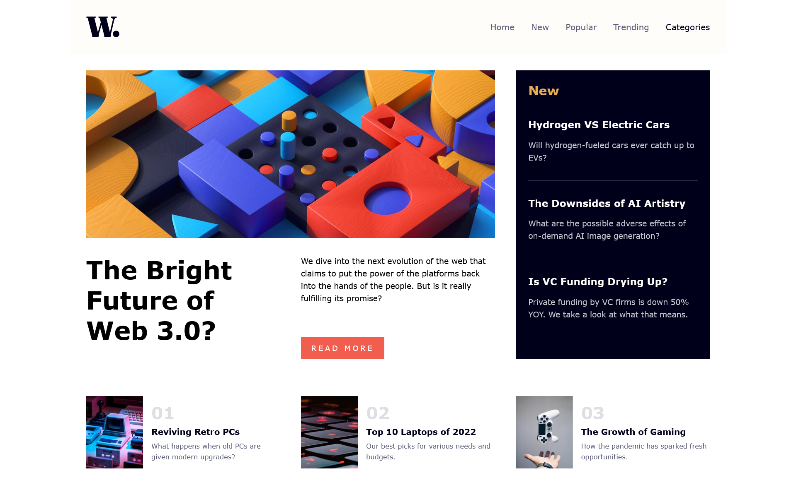

# Frontend Mentor - News homepage solution

This is a solution to the [News homepage challenge on Frontend Mentor](https://www.frontendmentor.io/challenges/news-homepage-H6SWTa1MFl).

## Table of contents

- [Overview](#overview)
  - [The challenge](#the-challenge)
  - [Screenshot](#screenshot)
  - [Links](#links)
  - [Built with](#built-with)
  - [What I learned](#what-i-learned)
- [Author](#author)

## Overview

### The challenge

Users should be able to:

- View the optimal layout for the interface depending on their device's screen size
- See hover and focus states for all interactive elements on the page
-Interact with buttons in mobile navigation

### Screenshot

  

### Links

- Solution URL: [Repo](https://github.com/Ibrahim-003/juniorProject_4)
- Live Site URL: [landing page](https://ibrahim-003.github.io/juniorProject_4/)

### Built with

- Semantic HTML5 markup
- CSS custom properties
- Flexbox
- CSS Grid
- Mobile-first workflow
- JS

### What I learned

Implement JS for mobile navigation control, showing and hiding the navigation bar depending on the user's interaction with the buttons.

## Author

-Ibrahim Almeyda 
- Frontend Mentor - [@IbrahimA](https://www.frontendmentor.io/profile/Ibrahim-003)
